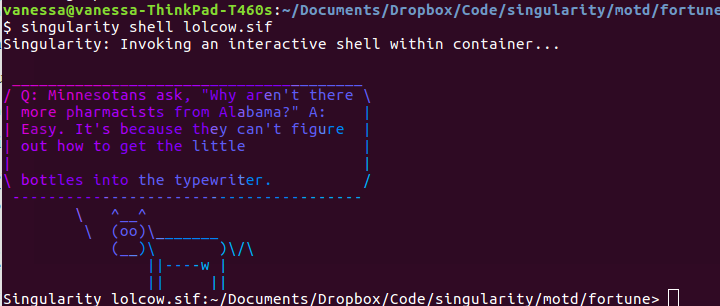

# Singularity MOTD with Fortunes

If you want to give your user a fun fortune, you can do that too.

## Simple Fortunes

```bash
$ sudo singularity build fortune.sif Singularity
```

And now see your fortune on shell!

```bash
$ singularity shell fortune.sif
Singularity: Invoking an interactive shell within container...

In India, "cold weather" is merely a conventional phrase and has come into
use through the necessity of having some way to distinguish between weather
which will melt a brass door-knob and weather which will only make it mushy.
		-- Mark Twain
```

## Lolcow Fortunes

It's much more fortuitous if it comes from the lolcow! You can see the
[Singularity.lolcow](Singularity.lolcow) recipe for this example:

```bash
$ sudo singularity build lolcow.sif Singularity.lolcow
```


