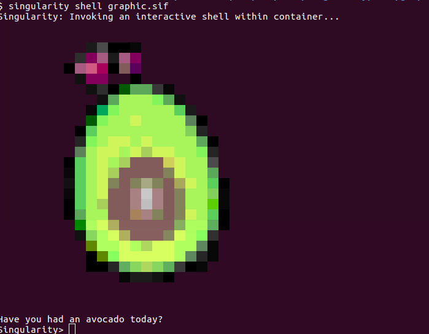

# Graphic Greetings

This example is a bit more advanced - we use [gotermimg](https://github.com/moshen/gotermimg) to
greet the user with a colored image, or an animation! See the [Singularity](Singularity)
recipe for an image:

Yeah, it's a bit overkill, but fun nonetheless!
